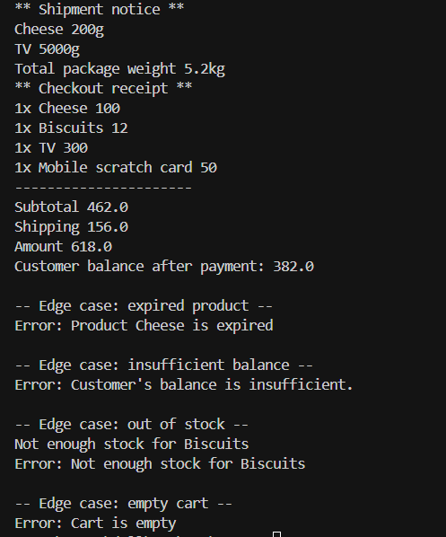

#  Fawry Quantum Internship Challenge 

##  Overview
This project is an e-commerce system built for the Fawry Rise Journey Full Stack Internship Challenge. It supports:

- Expirable products
- Shippable products (with weight)
- Cart operations with quantity limits
- Checkout process including:
  - Subtotal calculation
  - Shipping fee calculation
  - Final amount deduction from customer balance
- ShippingService handling

---

##  Product Types

- `NormalProduct` – Non-expirable, non-shippable
- `ExpirableProduct` – Expirable only
- `ShippableProduct` – Shippable only
- `ExpirableAndShippableProduct` – Both expirable and shippable

---

###  Successful Checkout + Shipment

### Edge Cases Handled:

- ❌ Expired Product
- ❌ Insufficient Customer Balance
- ❌ Out of Stock
- ❌ Empty Cart
